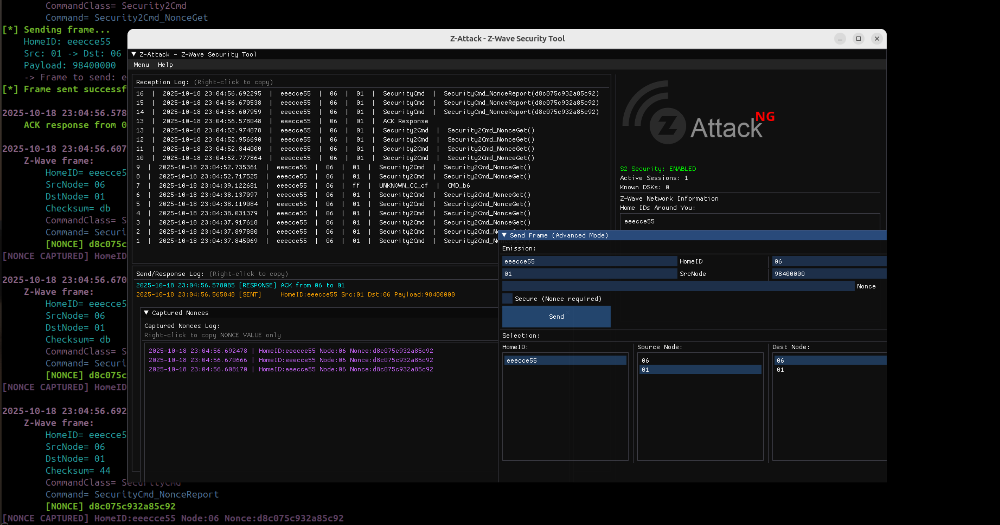
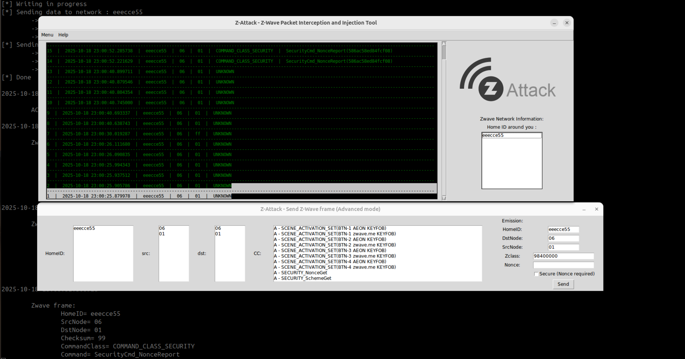

# Z-Attack-NG

<div align="center">


**Next Generation Z-Wave Security Testing Framework**

[](https://www.python.org/downloads/)
[](https://www.gnu.org/licenses/gpl-3.0)
[](https://github.com/PentHertz/Z-Attack-ng)

*Professional Z-Wave packet interception, analysis, and injection tool with full S2 security support*

[Features](#-features) • [Installation](#-installation) • [Quick Start](#-quick-start) • [Documentation](#-documentation) • [Credits](#-credits)

</div>

---

## 📋 Overview

**Z-Attack-NG** is an interactive security research framework for Z-Wave protocol analysis and testing. Born from the original Z-Attack by Advens (2015), this next-generation version has been completely rewritten with modern Python 3, featuring a professional ImGui interface, modular architecture, and **Z-Wave S2 security support** in beta for the moment.



### What's New in NG?

- 🎨 **Modern ImGui Interface** - Responsive GUI with real-time visualization replacing the old Tk one
- 🏗️ **Modular Architecture** - "Clean" separation of concerns (GUI, Core, Hardware, S2)
- 🔐 **S2 Support** - ECDH key exchange capture and AES-CCM decryption
- ⚡ **Z-Wave Plus** - Enhanced command class support (more classes to come)
- 📊 **Advanced Analytics** - Session management, nonce tracking, and export capabilities
- 🛠️ **New CLI** - argparse-based command-line interface
- 🧩 **Plugin-Ready** - Extensible architecture for custom modules

---

## ✨ Features

### 🔍 Packet Analysis
- **Real-time Interception** - Live capture of Z-Wave traffic
- **Protocol Decoding** - Automatic parsing of implemented command classes
- **Smart Filtering** - Focus on specific networks, nodes, or command classes
- **Hex Dump Viewer** - Raw packet inspection with detailed breakdowns

### 🔐 Security Testing

#### S0 (Security 0) - ✅ Full Support
- ✅ Complete encryption/decryption
- ✅ Nonce capture and management
- ✅ AES-128 OFB mode
- ✅ Frame injection with encryption
- ✅ Network key management

#### S2 (Security 2) - ✅ Beta Support
- ✅ **ECDH Curve25519** key exchange capture
- ✅ **AES-CCM** authenticated encryption/decryption
- ✅ **All security classes** (Unauthenticated, Authenticated, Access Control)
- ✅ **DSK-based** device pairing
- ✅ **Perfect Forward Secrecy** support
- ✅ **SPAN replay protection**
- ✅ **Session management** with export capabilities

### 🗺️ Network Visualization
- **Interactive Topology Map** - Real-time network visualization
- **Node Discovery** - Automatic device identification
- **Relationship Mapping** - Controller-to-device connections
- **Export Options** - Generate static graphs (PNG/SVG)

### 💉 Packet Injection
- **Advanced Mode** - Full control over frame construction
- **Easy Mode** - Pre-configured common commands
- **Secure Injection** - Support for S0-encrypted frames
- **Template Library** - Reusable command templates

### 📊 Logging & Export
- **Timestamped Logs** - Detailed packet history
- **CSV Export** - Analysis-ready data format
- **Nonce Database** - S0 nonce tracking and export
- **S2 Session Export** - Save key material and session data
- **Copy-Paste** - Right-click context menus

---

## 🚀 Quick Start

### Prerequisites

**Hardware Requirements:**
- **RfCat** compatible device (recommended), OR
- **Texas Instruments** CC1110/CC1111 development kit
- TODO: Evil Crow RF V2, and maybe others? (soon)
- TODO: Software-Defined Radio to implement (soon)

**Software Requirements:**
- Python 3.8 or higher
- Git

### Installation

## 🚀 Installation

### Using Poetry (Recommended)
```bash
# Install Poetry
curl -sSL https://install.python-poetry.org | python3 -

# Clone repository
git clone https://github.com/penthertz/Z-Attack-ng.git
cd Z-Attack-ng

# Install dependencies
poetry install

# Run Z-Attack-NG
poetry run python ZAttackNG
```

### Using pip (Traditional)

```bash
# Clone the repository
git clone https://github.com/penthertz/Z-Attack-ng.git
cd Z-Attack-ng

# Install Python dependencies
pip install -r requirements.txt [--break-install]

# (Optional) Install Graphviz for network graph export
# Ubuntu/Debian:
sudo apt-get install graphviz

# macOS:
brew install graphviz

# Windows: Download from https://graphviz.org/download/
```

### First Run
```bash
# Using RfCat (default)
python ZAttackNG

# With debug mode
python ZAttackNG -d

# Using TI RF Kit
python ZAttackNG --serial -lcom /dev/ttyUSB0 -scom /dev/ttyUSB1

# Show all options
python ZAttackNG --help
```

---

## 🔐 S2 Decryption Guide

Want to decrypt Z-Wave S2 traffic? Follow these simple steps:

### Step 1: Get the DSK
The **Device Specific Key (DSK)** is printed on your device label or QR code.

Format: `12345-67890-12345-67890-12345-67890-12345-67890`

### Step 2: Start Z-Attack-NG
```bash
python ZAttackNG
```

### Step 3: Add DSK
1. Click **Menu → Add S2 DSK**
2. Enter **Node ID** (e.g., `02`)
3. Enter **DSK** from device label
4. Click **Add DSK**

### Step 4: Capture Key Exchange
Initiate device pairing. Z-Attack-NG will automatically:
- Capture the ECDH public keys
- Compute the shared secret
- Derive all encryption keys

### Step 5: Decrypt!
All subsequent S2 messages from this device will be automatically decrypted! 🎉

**Monitor progress:** Check the console output for `[S2] ✓✓✓ DECRYPTED ✓✓✓` messages.

---

## 📖 Documentation

### Command Line Options
```
usage: ZAttackNG [-h] [-1 | -2] [-lcom PORT] [-scom PORT] [-d] [-csv] [--no-csv]
               [-k KEY] [-v]

Z-Attack-NG 1.0 - Z-Wave Security Testing Tool

Options:
  -h, --help            Show this help message and exit
  -1, --rfcat           Use RfCat device (default)
  -2, --serial          Use TI RF KIT (serial device)
  -lcom PORT, --listen-port PORT
                        Listening COM port for TI RF KIT
  -scom PORT, --send-port PORT
                        Sending COM port for TI RF KIT
  -d, --debug           Enable debug mode (verbose output)
  -csv, --csv-output    Enable CSV output to file (default: enabled)
  --no-csv              Disable CSV output
  -k KEY, --key KEY     Network key for S0 decryption (hex string)
  -v, --version         Show program version and exit
```

### Supported Command Classes

Z-Attack-NG supports:

<details>
<summary>Click to expand full list</summary>

**Security:**
- Security S0 (0x98) - Legacy encryption
- Security S2 (0x9F) - Modern encryption with ECDH

**Control:**
- Basic (0x20)
- Switch Binary (0x25)
- Switch Multilevel (0x26)
- Switch All (0x27)
- Scene Activation (0x2B)
- Central Scene (0x5B)

**Sensors:**
- Sensor Binary (0x30)
- Sensor Multilevel (0x31)
- Meter (0x32)
- Alarm/Notification (0x71)

**Configuration:**
- Configuration (0x70)
- Association (0x85)
- Multi Channel Association (0x8E)
- Wake Up (0x84)
- Battery (0x80)

**Advanced:**
- Multi Channel (0x60)
- Color Control (0x33)
- Door Lock (0x62)
- User Code (0x63)
- Barrier Operator (0x66)
- Thermostat Mode (0x40)
- Thermostat Setpoint (0x43)

**Device Info:**
- Version (0x86)
- Manufacturer Specific (0x72)
- Z-Wave Plus Info (0x5E)
- Device Reset Locally (0x5A)

*...and many more!*

</details>

---

## 🏗️ Architecture
```
Z-Attack-ng/
├── main.py                 # Entry point with modern argument parsing
├── config.py               # Global configuration and settings
├── requirements.txt        # Python dependencies
│
├── core/                   # Core Z-Wave protocol handling
│   ├── __init__.py
│   ├── protocol.py        # Frame parsing and construction
│   ├── crypto.py          # S0 encryption/decryption
│   └── network.py         # Network topology management
│
├── s2/                    # S2 Security module
│   ├── __init__.py
│   ├── s2_crypto.py       # ECDH, AES-CCM, key derivation
│   └── s2_manager.py      # Session management, KEX handling
│
├── hardware/              # Hardware abstraction layer
│   ├── __init__.py
│   ├── rfcat_device.py    # RfCat interface
│   └── serial_device.py   # TI RF Kit interface
│
├── gui/                   # ImGui-based interface
│   ├── __init__.py
│   ├── main_window.py     # Main application window
│   ├── windows.py         # Popup windows (send, nonce, etc.)
│   ├── s2_window.py       # S2 management windows
│   └── utils.py           # GUI utilities (logging, textures)
│
├── data/                  # Data files and parsers
│   ├── zwClasses.py       # Command class definitions
│   ├── sendData.py        # Pre-configured commands
│   └── manufacturer_specific.xml
│
└── images/                # GUI assets
    ├── zattack.png
    └── penthertz.png
```

---

## 🛠️ Hardware Support

### RfCat (Recommended)
- **Compatibility:** YardStick One, RfCat dongle
- **Frequency:** 868.4 MHz (EU) / 908.4 MHz (US)
- **Setup:** Automatic configuration
- **Status:** ✅ Fully supported

### Texas Instruments RF Kit
- **Compatibility:** CC1110, CC1111 development boards
- **Interface:** Dual UART (listen + send)
- **Setup:** Manual port configuration
- **Status:** ✅ Fully supported

---

## 🎯 Use Cases

### Security Research
- Analyze Z-Wave network security posture
- Test device encryption implementations
- Discover protocol vulnerabilities
- Validate security configurations

### Smart Home Auditing
- Map home automation networks
- Identify unsecured devices
- Test access control policies
- Verify encryption standards

### Protocol Analysis
- Reverse engineer device behavior
- Document command implementations
- Create device fingerprints
- Study protocol compliance

### Penetration Testing
- Include in IoT security assessments
- Demonstrate Z-Wave vulnerabilities
- Test network segmentation
- Validate incident response

---

## 📊 Screenshots

### Main Interface
Real-time packet interception with dual-log display:
- Reception log (top) - Intercepted traffic
- Send/Response log (bottom) - Your injections and ACKs

### Network Discovery
Interactive topology map with:
- Visual node relationships
- Live connection status
- Controller identification
- Export to static images

### S2 Security Manager
Comprehensive session management:
- Active session monitoring
- DSK configuration
- Public key capture
- Nonce tracking

*(Screenshots coming soon)*

---

## 🔬 Research & Publications

This tool has been used in various security research projects:

- **Z-Wave Security Analysis** - Penthertz Research (2025)
- **Smart Home Security Testing** - Advens (2015)

---

## 🤝 Contributing

We welcome contributions! Here's how you can help:

### Ways to Contribute
- 🐛 **Report bugs** - Open an issue with detailed reproduction steps
- 💡 **Suggest features** - Share your ideas for improvements
- 📝 **Improve docs** - Help us make the documentation better
- 🔧 **Submit PRs** - Fix bugs or add features

### Development Setup
```bash
# Fork and clone
git clone https://github.com/PentHertz/Z-Attack-ng.git
cd Z-Attack-ng

# Create feature branch
git checkout -b feature/amazing-feature

# Make changes and test
python ZAttackNG -d

# Commit and push
git commit -m "Add amazing feature"
git push origin feature/amazing-feature

# Open Pull Request
```

---

## 📜 License

This project is licensed under the **GNU General Public License v3.0** - see the [LICENSE](LICENSE) file for details.
```
Z-Attack-NG - Next Generation Z-Wave Security Testing Framework
Copyright (C) 2025 Penthertz

This program is free software: you can redistribute it and/or modify
it under the terms of the GNU General Public License as published by
the Free Software Foundation, either version 3 of the License, or
(at your option) any later version.

This program is distributed in the hope that it will be useful,
but WITHOUT ANY WARRANTY; without even the implied warranty of
MERCHANTABILITY or FITNESS FOR A PARTICULAR PURPOSE.
```

---

## 🙏 Credits

### Original Author
**Advens Security Research Team** (2015)  
Website: [advens.fr](https://www.advens.fr)  
Original project: [github.com/Advens/Z-Attack](https://github.com/Advens/Z-Attack)

### Refactored & Enhanced By
**Penthertz** (2025)  
Website: [penthertz.com](https://penthertz.com)  
Twitter: [@penthertz](https://twitter.com/penthertz)

### Special Thanks
- The **RfCat** project for excellent RF tools
- **Z-Wave Alliance** for protocol documentation
- The open-source security community

---

## 📈 Changelog

### [1.0] - 2025-01-19
#### Added
- Complete Python 3 rewrite with modern architecture
- ImGui-based professional interface
- Full S2 (Security 2) decryption support
  - ECDH Curve25519 key exchange
  - AES-CCM authenticated encryption
  - DSK-based device pairing
  - Session management
- Modular architecture (core, gui, s2, hardware)
- Modern argparse CLI
- 60+ command class parsers
- Interactive network topology visualization
- Enhanced logging and export capabilities

#### Changed
- Migrated from Python 2 to Python 3.8+
- Replaced Tkinter with ImGui for better UX
- Restructured codebase for maintainability
- Updated all dependencies to modern versions


### [0.1] - 2015
- Initial release by Advens
- Basic Z-Wave packet interception
- Injection capabilities
- RfCat and TI Kit support
- S0 decryption

